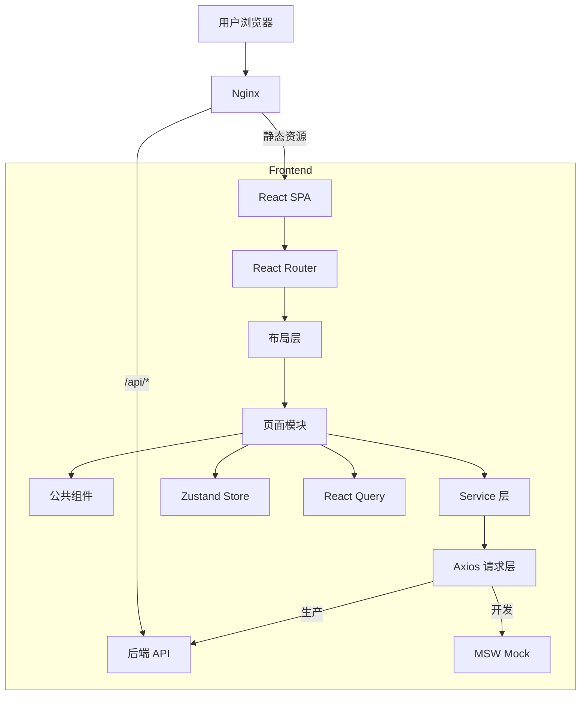

# 架构设计文档

## 整体架构



## 目录结构与职责

```
src/
├── api/                  # HTTP 基础设施
│   ├── request.ts        # Axios 实例、拦截器、Token 刷新
│   ├── adapter.ts        # 响应格式适配（Mock ↔ 真实后端）
│   ├── token.ts          # Token 存取
│   └── error.ts          # 统一错误类
├── components/           # 公共 UI 组件
│   ├── DataTable/        # 分页数据表格
│   ├── FormDrawer/       # 抽屉表单
│   ├── SearchFilterBar/  # 筛选栏
│   ├── StatusTag/        # 状态标签
│   ├── PageHeader/       # 页头
│   ├── MoneyDisplay/     # 金额展示
│   ├── EmptyState/       # 空状态
│   ├── ConfirmDialog/    # 确认弹窗
│   ├── PermissionGuard/  # 权限守卫
│   ├── ErrorBoundary/    # 错误边界
│   └── RouteLoading/     # 路由加载
├── hooks/                # 公共 Hooks
│   ├── useTableQuery.ts  # 分页查询（Query + 翻页 + 筛选）
│   ├── useDebounce.ts    # 防抖
│   ├── useHasRole.ts     # 角色判断
│   └── ...
├── layouts/              # 布局
│   ├── AppLayout.tsx     # 主布局（Sidebar + Header + Content）
│   ├── Sidebar.tsx       # 侧边栏（角色过滤菜单）
│   ├── HeaderBar.tsx     # 顶栏（主题切换、通知、用户菜单）
│   ├── Breadcrumb.tsx    # 面包屑
│   └── BlankLayout.tsx   # 空白布局（登录页）
├── locales/              # 国际化
│   ├── i18n.ts           # i18next 配置
│   ├── zh-CN.json        # 中文翻译（540 keys）
│   └── en-US.json        # 英文翻译（540 keys）
├── mocks/                # MSW Mock
│   ├── browser.ts        # Worker 启动
│   └── handlers/         # 按模块组织的 mock handlers
├── pages/                # 页面模块（按路由目录组织）
│   ├── login/            # 登录
│   ├── platform/         # 平台管理（公司）
│   ├── org/              # 组织管理（项目、员工）
│   ├── customers/        # 客户管理（租户）
│   ├── properties/       # 房源管理（房源树、入住记录）
│   ├── contracts/        # 合同管理
│   ├── billing/          # 收费管理（费项、账单、抄表、支付）
│   ├── service/          # 服务工单（报修、投诉）
│   ├── notice/           # 公告通知
│   ├── dashboard/        # 仪表盘
│   ├── reports/          # 数据报表
│   └── system/           # 系统管理（审计日志）
├── router/               # 路由配置
│   ├── index.tsx         # 路由定义（懒加载）
│   └── routes.config.ts  # 菜单配置
├── services/             # API Service 层
│   ├── auth.service.ts
│   ├── company.service.ts
│   ├── project.service.ts
│   └── ...（17 个 service）
├── store/                # Zustand 全局状态
│   ├── user.store.ts     # 用户信息 + 角色
│   ├── theme.store.ts    # 亮/暗模式
│   ├── project.store.ts  # 当前项目
│   ├── menu.store.ts     # 侧边栏状态
│   └── notification.store.ts  # 未读消息数
├── types/                # TypeScript 类型
│   ├── api/              # 请求/响应 DTO
│   ├── domain/           # 领域实体
│   ├── enums.ts          # 枚举常量
│   └── index.ts          # 统一导出
└── utils/                # 工具函数
    ├── format.ts         # 日期/金额/手机号格式化
    ├── mask.ts           # 脱敏
    ├── storage.ts        # localStorage 封装
    └── antd.ts           # AntD 消息 API
```

## 状态管理策略

| 状态类型 | 方案 | 示例 |
|---------|------|------|
| 全局 UI 状态 | Zustand | 主题、菜单折叠、当前用户 |
| 服务端数据 | React Query | 列表查询、详情获取、CRUD 操作 |
| 页面内状态 | useState / useReducer | 弹窗开关、表单临时值 |
| URL 状态 | React Router searchParams | 分页参数、筛选条件 |

## 路由与权限体系

- 路由在 `router/index.tsx` 中统一定义，非首屏路由均已 `React.lazy()` 懒加载
- 菜单配置在 `routes.config.ts` 中通过 `roles` 字段声明访问权限
- `Sidebar` 根据当前用户角色过滤菜单项
- `PermissionGuard` 组件可在页面或按钮级别做权限控制

角色体系：

| 角色 | 权限范围 |
|------|---------|
| PLATFORM_ADMIN | 全平台管理 |
| COMPANY_ADMIN | 公司级管理 |
| PROJECT_MANAGER | 项目级管理 |
| FINANCE | 财务审批 |
| CUSTOMER_SERVICE | 客服工单 |
| ENGINEER | 工程维修 |

## API 层架构

```
请求流程：
Page → Service → http.get/post/... → Axios 拦截器
                                       ├── 请求拦截：注入 Bearer Token
                                       └── 响应拦截：
                                           ├── adapter.ts 解包（真实后端 { code, data } → data）
                                           ├── 401 → Token 自动刷新 → 重放请求
                                           └── 其他错误 → Toast 提示
```

Mock 与真实后端切换：
- `VITE_ENABLE_MSW=true`：启动 MSW Service Worker 拦截请求
- `VITE_ENABLE_MSW=false`：请求直达后端，`adapter.ts` 自动解包 `{ code: 200, data: T }` 格式
- Service 层无需任何修改

## 组件设计原则

1. **泛型组件**：`DataTable<T>`, `SearchFilterBar<T>`, `StatusTag<T>` 均支持泛型
2. **组合优于继承**：通过 `children` 和 `render props` 扩展
3. **关注点分离**：组件只负责渲染，数据逻辑在 hooks 和 services 中
4. **国际化优先**：所有文案通过 `t()` 函数引用
5. **无障碍访问**：关键元素添加 `aria-label`，语义化标签（`nav`、`main`）
